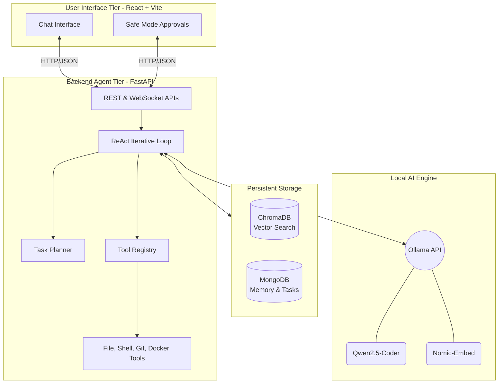
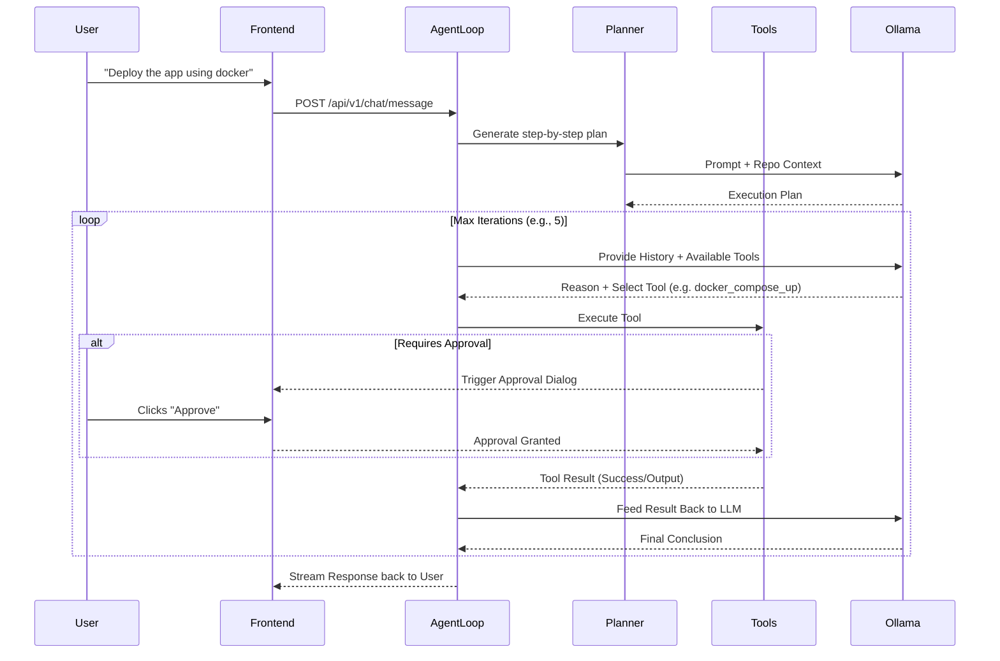

<div align="center">
  
  
  <h1>🤖 Local AI DevOps Engineering Agent</h1>
  <p><em>A production-ready, fully self-hosted AI agent capable of understanding repositories, executing DevOps workflows, modifying code, and chatting about system architecture—entirely powered by local LLMs via Ollama.</em></p>

  [](https://fastapi.tiangolo.com/)
  [](https://react.dev/)
  [](https://www.python.org/)
  [](https://ollama.com/)
  [](https://www.trychroma.com/)
  [](https://www.mongodb.com/)
</div>

---

## 📋 Table of Contents
1. [Introduction](#-introduction)
2. [Core Features](#-core-features)
3. [Architecture Overview](#-architecture-overview)
4. [Technology Stack](#-technology-stack)
5. [Getting Started](#-getting-started)
6. [Project Structure](#-project-structure)
7. [Safe Mode & Approvals](#-safe-mode--approvals)
8. [License](#-license)

---

## 🌟 Introduction

The **Local AI DevOps Engineering Agent** is designed to be a localized replacement for cloud-based engineering assistants (like Cursor or Copilot). Because it uses **Ollama**, **ChromaDB**, and **MongoDB** entirely on your local machine, your proprietary code never leaves your network. 

The agent utilizes an advanced **ReAct Loop (Reason + Act)** combined with a **Planner** to execute complex multi-step DevOps and coding tasks.

---

## 🚀 Core Features

- **Full Repository Context**: Automatically scans, chunks, and indexes your entire codebase into ChromaDB using local embedding models (e.g., `nomic-embed-text`).
- **Autonomous Planner**: Breaks down complex user requests (e.g., "Fix the authentication bug") into sequential, actionable steps.
- **Robust Toolchain**:
  - 📁 *File Operations*: Read, write, create, delete, and replace text across the codebase.
  - 🖥️ *Terminal Execution*: Run bash/powershell commands directly on the host machine.
  - 🌿 *Git Operations*: Status, commit, diff, branch creation, and PR summaries.
  - 🐳 *DevOps Automation*: Trigger Docker Compose, Terraform, Kubernetes, and testing pipelines.
- **Strict Safe Mode**: Destructive commands (writes, deletes, shell execution) trigger a frontend approval dialog before execution.
- **Persistent Memory**: Uses MongoDB to remember past decisions, architecture notes, and conversation context across sessions.

---

## 🏗 Architecture Overview

The system is separated into three primary tiers: the React Frontend, the FastAPI Backend Agent, and the Storage/LLM engines.

### 1. High-Level System Architecture



### 2. The Agentic Reasoning Loop (ReAct)

When a user submits a prompt, the Agent follows a precise iterative cycle:



---

## 💻 Technology Stack

| Component | Technology | Description |
|-----------|------------|-------------|
| **Frontend** | React, TypeScript, TailwindCSS, Vite | Highly responsive, dark-themed UI with real-time streaming. |
| **Backend** | Python 3.12, FastAPI, AsyncIO | High-performance async backend framework. |
| **LLM Engine**| Ollama | Runs open-source models (Qwen, DeepSeek) locally. |
| **Vector DB** | ChromaDB | Stores text chunks and vectors for fast semantic search (RAG). |
| **Database**  | MongoDB (Motor Async) | Stores chat histories, tasks, and system state. |
| **Logging**   | Loguru | Beautiful, rotating, and structured system logging. |

---

## 🚀 Getting Started

### 1. Prerequisites
Ensure you have the following installed on your host machine:
- **Python 3.12+**
- **Node.js 18+**
- **MongoDB**: Running locally on `localhost:27017`
- **Ollama**: Running locally on `localhost:11434`

**Pull Required Models into Ollama:**
```bash
ollama pull qwen2.5-coder
ollama pull nomic-embed-text
```

### 2. Backend Setup
Navigate to the `backend` directory and set up the Python environment.

**Windows:**
```powershell
cd backend
python -m venv .venv
.venv\Scripts\activate
pip install -r requirements.txt
uvicorn app:app --reload
```

**macOS / Linux:**
```bash
cd backend
python3 -m venv .venv
source .venv/bin/activate
pip install -r requirements.txt
uvicorn app:app --reload
```
*The backend API will be available at `http://localhost:8000`.*

### 3. Frontend Setup
Navigate to the `frontend` directory and install NPM packages.

```bash
cd frontend
npm install
npm run dev
```
*The frontend interface will be available at `http://localhost:5173`.*

---

## 📂 Project Structure

```text
LocalAgent/
├── backend/
│   ├── agent/           # ReAct Agent Loop logic
│   ├── api/             # FastAPI REST Routers & Endpoints
│   ├── approval/        # Safe Mode approval interceptors
│   ├── config/          # Environment & Pydantic Settings
│   ├── embeddings/      # Ollama Embedding wrappers
│   ├── indexing/        # Codebase scanners & chunking logic
│   ├── llm/             # Ollama Chat completions
│   ├── memory/          # MongoDB async adapters
│   ├── planner/         # Task planning strategies
│   ├── tools/           # Executable Tools (Git, Terminal, FileOps)
│   ├── vector_store/    # ChromaDB persistent adapters
│   └── tests/           # Pytest suites
└── frontend/
    ├── src/
    │   ├── api/         # Fetch API clients
    │   ├── components/  # Chat & Approval Dialog UI
    │   ├── index.css    # Tailwind directives
    │   └── App.tsx      # Application Entrypoint
    ├── tailwind.config.js
    └── vite.config.ts
```

---

## 🔒 Safe Mode & Approvals

Because the agent has terminal access, security is paramount. By default, `REQUIRE_APPROVAL_FOR_FILE_MODS` and `REQUIRE_APPROVAL_FOR_TERMINAL` are set to `True` in `backend/config/settings.py`.

Whenever the agent attempts to run a destructive tool (e.g., `git push`, `rm -rf`, writing to a file), execution halts. A dialog will pop up on the React Frontend displaying the exact command/code to be executed, requiring human verification before proceeding.

---

## 🤝 Contributing

Contributions are welcome! If you would like to add a new DevOps tool to the registry:
1. Create a new class inheriting from `BaseTool` in `backend/tools/`.
2. Define the JSON schema in the `parameters` property.
3. Call `registry.register()` at the bottom of the file.

## 📄 License

This project is licensed under the MIT License - see the LICENSE file for details.
