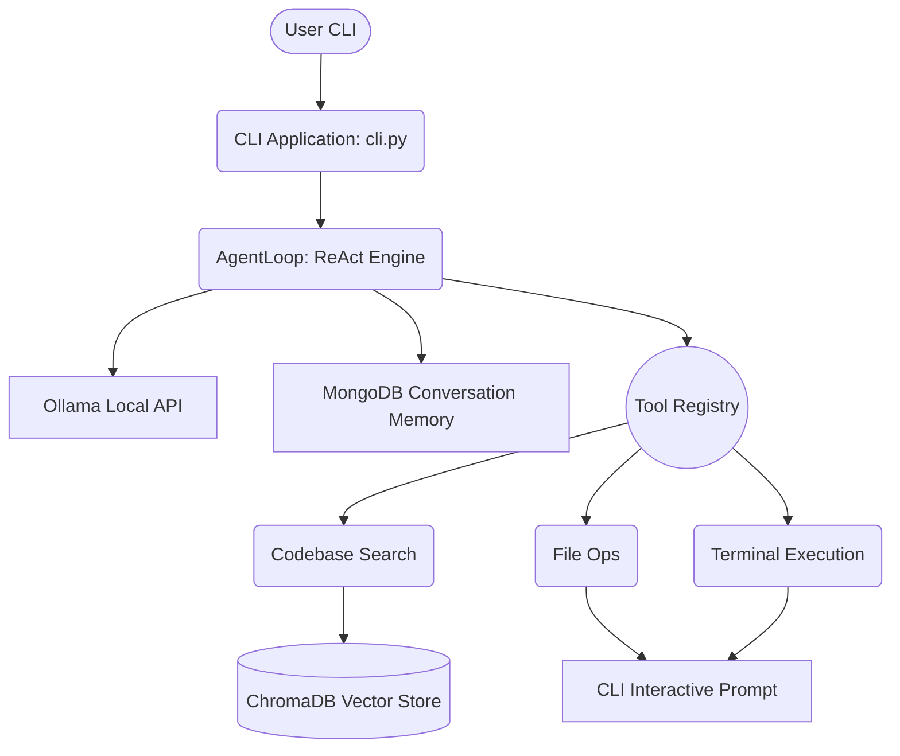

# Local AI DevOps Engineering Agent

A completely self-hosted, autonomous DevOps and Software Engineering Agent powered by local LLMs (via Ollama). This agent is a **Professional Terminal CLI Application** (similar to Claude Code or Cline) that can understand your codebase, edit files, execute terminal commands, and perform RAG (Retrieval-Augmented Generation) entirely locally.

---

## 🌟 Features

- **Pure Terminal CLI:** Beautiful, interactive command-line interface with markdown streaming, dropdown menus, and inline approval prompts.
- **Dynamic Model Selection:** Automatically detects models installed in your local Ollama instance (e.g., `qwen2.5-coder`, `deepseek-coder`) and lets you choose one at startup.
- **Autonomous ReAct Loop:** Enforces a strict `Thought -> Action -> Observation` loop, parsing JSON tool calls robustly.
- **Safe Mode (Human-in-the-Loop):** Inline terminal prompts (`[y/N]`) before executing any destructive tools like writing to files or running terminal commands.
- **RAG Codebase Search:** Uses ChromaDB and Ollama embeddings to semantically search your entire codebase to gain context.
- **Memory Persistence:** Uses local MongoDB to save long-term conversation history.

---

## 🏗️ Architecture



---

## 🚀 Getting Started

### 1. Prerequisites
- **Python 3.12+**
- **Ollama**: Installed and running locally. Pull at least one model (e.g., `ollama run qwen2.5-coder`).
- **MongoDB**: Installed and running locally on default port 27017.

### 2. Installation
```bash
git clone https://github.com/manoj-chavan-13/LocalAgent.git
cd LocalAgent/backend

# Create a virtual environment
python -m venv .venv
source .venv/bin/activate  # On Windows: .venv\Scripts\activate

# Install dependencies
pip install -r requirements.txt
```

### 3. Usage
Run the CLI application directly:

```bash
python cli.py
```

The CLI will:
1. Connect to MongoDB.
2. Connect to Ollama and prompt you to select an installed model.
3. Drop you into an interactive chat loop.

Just type your request! The agent will begin reasoning, use tools autonomously, and prompt you for permission before editing any files.
