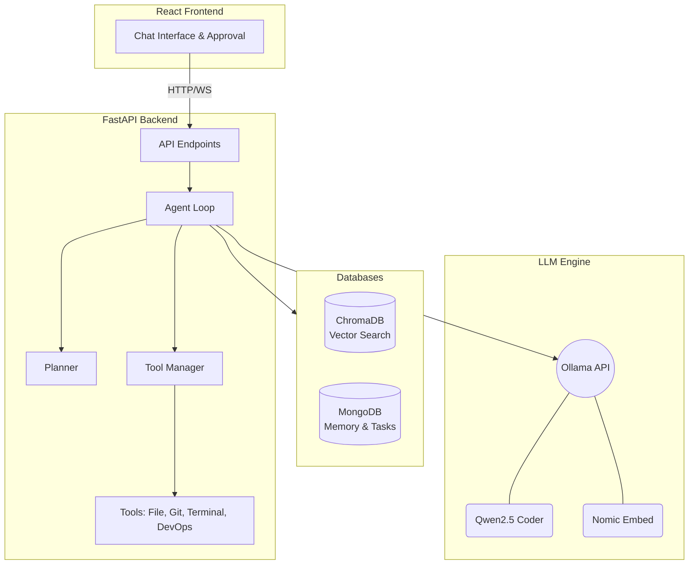

# Local AI DevOps Engineering Agent


A production-quality Local AI DevOps Engineering Agent, completely self-hosted using Ollama. This agent acts as your localized AI DevOps engineer, capable of understanding your codebase, running DevOps tasks safely, managing terminal commands, and chatting with you about architecture and repository details.

---

## 🏗 Architecture Overview

The system is broken down into a **Frontend** interface, a **Backend** FastAPI server, and a dual-database memory system (MongoDB + ChromaDB).



## 🚀 Features

- **Chat Interface**: Talk to your codebase and ask architecture questions.
- **Repository Indexing**: Parses all files, creates chunks, and generates embeddings using `nomic-embed-text` into ChromaDB.
- **Tool Execution**: Tools for File IO, Terminal Execution, Git Ops, and DevOps workflows.
- **Agent Planner Loop**: The Agent creates step-by-step plans for complex requests before acting.
- **Safe Mode Approvals**: Any potentially destructive terminal commands or file modifications are sent to an Approval Manager before execution.
- **MongoDB Memory**: Conversations and task histories are persisted locally in MongoDB.

---

## 💻 Setup Instructions

### 1. Prerequisites (All Systems)
- **Python 3.12+**
- **Node.js 18+**
- **Ollama**: [Install Ollama](https://ollama.com/)
- **MongoDB**: [Install MongoDB Community Edition](https://www.mongodb.com/try/download/community)

Ensure Ollama has the models pulled locally:
```bash
ollama run qwen2.5-coder
ollama pull nomic-embed-text
```

### 2. Backend Setup
The backend uses FastAPI and Motor (async MongoDB). 

**On macOS / Linux:**
```bash
cd backend
python3 -m venv .venv
source .venv/bin/activate
pip install -r requirements.txt
uvicorn app:app --reload
```

**On Windows:**
```powershell
cd backend
python -m venv .venv
.venv\Scripts\activate
pip install -r requirements.txt
uvicorn app:app --reload
```

*Note: The backend runs by default on `http://localhost:8000`.*

### 3. Frontend Setup
The frontend uses React, TypeScript, and TailwindCSS via Vite.

```bash
cd frontend
npm install
npm run dev
```

*Note: The frontend runs by default on `http://localhost:5173`.*

---

## 🔒 Safe Mode
By default, `REQUIRE_APPROVAL_FOR_FILE_MODS` and `REQUIRE_APPROVAL_FOR_TERMINAL` are set to `True` in the backend settings. The frontend will intercept these requests and prompt you to Approve or Reject the Agent's action before it runs on your host machine.

---

## 🛠 Tech Stack

- **Backend**: Python 3.12, FastAPI, AsyncIO, Loguru, Pydantic
- **Frontend**: React, TypeScript, TailwindCSS, Vite
- **AI**: Ollama (Qwen2.5-Coder / DeepSeek)
- **Databases**: MongoDB (Motor Async), ChromaDB
